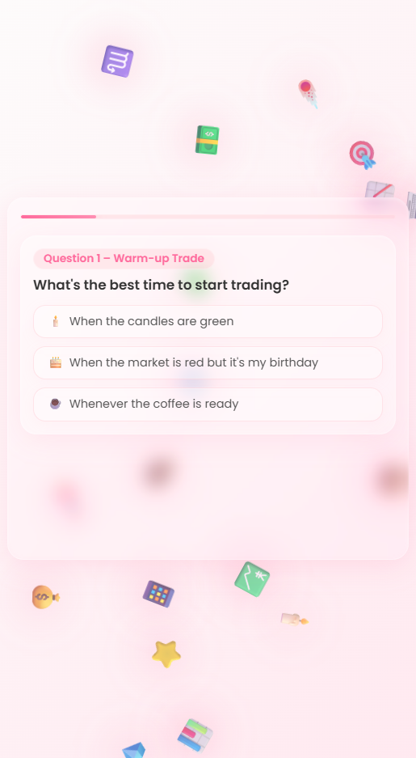
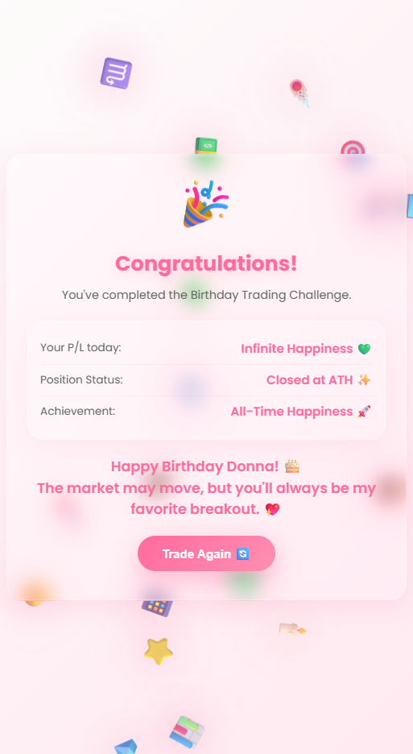

# Birthday Trading Challenge 🎉📈

An interactive **Trading-Themed Birthday Quiz Web App** designed for a unique and fun birthday celebration.  
This app turns a classic birthday greeting into a playful trading challenge, complete with charts, P/L statements, and market humor — all in a professional yet festive style.

---

## ✨ Features
- **Single HTML File** – All logic, styling, and content contained in `index.html` for quick deployment.
- **Animated Trading Theme** – Candlesticks, trading terms, and playful market references.
- **Quiz Flow** – 5 trading-themed questions with multiple choice answers.
- **Custom Celebration Page** – Final screen with animated congratulations, P/L message, and a replay option.
- **Birthday Personalization** – Hardcoded greeting for "Donna" (you can change in the HTML for other names).
- **Emojis & Icons** – Enhance the fun with market-related emojis (📈, 📊, 🚀, 💎).

---

## 🛠 Tech Stack
- **HTML5**
- **Vanilla JavaScript** *(Inline within index.html for handling quiz navigation)*
- **CSS3** *(Embedded styles or external in assets if expanded)*

---

## 📂 Project Structure
Since the app is self-contained in one file:
📦 birthday-trading-challenge

├─ index.html

├─ README.md

└─ assets/

├─ preview-quiz.png

├─ preview-result.png

---

## 🚀 How to Run
### 1. Local Run
Simply download or clone the repository and open `index.html` in any web browser.

### 2. GitHub Pages Deployment
1. Push the repository to GitHub.
2. Go to **Settings → Pages**.
3. Set source to branch **main** and folder `/ (root)`.
4. Save and get your public link, e.g.:
https://<your-username>.github.io/birthday-trading-challenge

---

## 🌐 Live Demo
https://psq0.github.io/Donna/

---

## 📸 Preview

  
  

---

## 📜 License
Free for personal and celebratory use.  
© 2025 [PSQ0]

